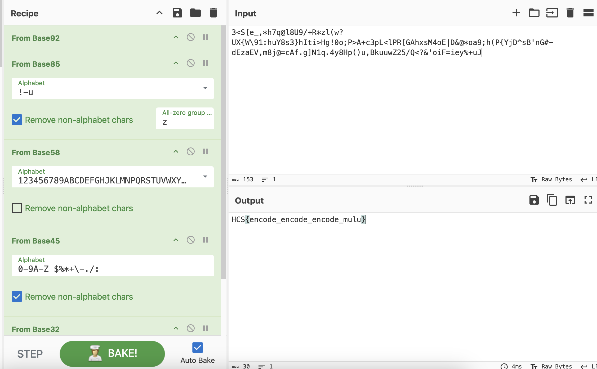

# Base? Base? Base? (Easy)

## Author
daffainfo

## Deskripsi
Aku dapat pesan rahasia dari hacker paling jago saat ini, tapi aku nggak tahu cara buat men "decode" pesan ini :(

## Writeup
Flag diencode menggunakan beberapa encoding yaitu

Plaintext -> base32 -> base45 -> base58 -> base85 -> base92

Untuk mendecodenya bisa dengan menggunakan [CyberChef](https://gchq.github.io/CyberChef/#recipe=From_Base92()From_Base85('!-u',true,'z')From_Base58('123456789ABCDEFGHJKLMNPQRSTUVWXYZabcdefghijkmnopqrstuvwxyz',false)From_Base45('0-9A-Z%20$%25*%2B%5C%5C-./:',true)From_Base32('A-Z2-7%3D',false)&input=MzxTW2VfLCpoN3FAbDhVOS8rUip6bCh3P1VYe1dcOTE6aHVZOHMzfWhJdGk%2BSGchMG87UD5BK2MzcEw8bFBSW0dBaHhzTTRvRXxEJkAqb2E5O2goUHtZakRec0InbkcjLWRFemFFVixtOGpAPWNBZi5nXU4xcS40eThIcCgpdSxCa3V1d1oyNS9RPD8mJ29pRj1pZXklK3VK) atau juga bisa dengan menggunakan fitur cipher identifier milik website [Dcode.fr](https://www.dcode.fr/cipher-identifier)

