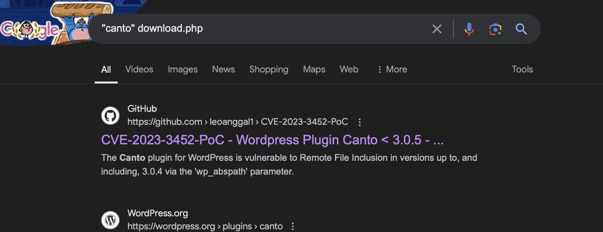

# Analisis Log (Med/Hard)

## Author
daffainfo

## Deskripsi
Baru juga nge-deploy website, ehhh 5 menit kemudian udah kena hack. Tolong bantu aku untuk menganalisis log ini dan jawablah pertanyaan-pertanyaan yang disediakan

## Writeup
Berikut pertanyaannya
1. Pukul berapa penyerang memulai melakukan "fuzzing"?

Bisa dilihat pada timestamp `06/Sep/2024:15:51:02` sampai `06/Sep/2024:15:51:09` penyerang mengirimkan banyak request dalam waktu yang singkat. Hal ini diperkuat dengan adanya `Fuzz Faster U Fool v2.1.0-dev` pada User-Agent yang memperkuat dugaan penyerang melakukan fuzzing pada server

Jawaban: **06/Sep/2024:15:51:02**

2. Plugin apa yang memiliki kerentanan yang dimanfaatkan oleh penyerang?

Hal ini bisa dicek hasil dari fuzzing, dimana disaat mengakses `/wp-content/plugins/canto/readme.txt` response codenya adalah 200 sedangkan plugin yang lain menghasilkan error code 404. Atau bisa juga dengan mengecek beberapa request setelah fuzzing, penyerang beberapa kali mengakses endpoint `/wp-content/plugins/canto`

Jawaban: **Canto / canto**

3. CVE apa yang dieksploitasi dalam serangan tersebut?

Bisa disearch pada google dengan mencari endpoint yang diakses oleh penyerang seperti "wp_asbpath", "canto", "download.php, dst.



Jawaban: **CVE-2023-3452**

4. Alamat IP apa saja yang dimiliki oleh penyerang?

Terdapat 2 IP, IP saat mengakses website yaitu `182.1.91.201` dan juga IP yang digunakan untuk mengeksploitasi website dengan `CVE-2023-3452` yaitu `68.183.26.104`

Jawaban: **68.183.26.104,182.1.91.201**

5. File apa yang diperiksa isinya oleh penyerang?

Pada parameter cmd, cek satu-persatu command yang dijalankan oleh penyerang. Disaat penyerang menjalankan command

```
root@daffainfo:~/# echo 'cG5nIC9yZ3AvY25mZmpx' | base64 -d | tr 'A-Za-z' 'N-ZA-Mn-za-m'
cat /etc/passwd
```

Jawaban: **/etc/passwd**

6. Apa nama file yang ditaruh oleh penyerang ke dalam server?

Tinggal decode command terakhir yang dijalankan penyerang

```
root@daffainfo:~/# echo 'cnB1YiAnPD9jdWMgcnB1YiAiVWJ5biBmcnpobmFsbiwgZnJ6YnRuIG92Zm4gem5maHggVVBGIExOTk4iID8+JyA+PiAvaW5lL2pqai91Z3p5L3FoZmdueF8zMjMxMi5jdWM=' | base64 -d | tr 'A-Za-z' 'N-ZA-Mn-za-m'
echo '<?php echo "Hola semuanya, semoga bisa masuk HCS YAAA" ?>' >> /var/www/html/dustak_32312.php
```

Jawaban: **dustak_32312.php**

Jika jawabannya sudah benar semua maka flag akan muncul